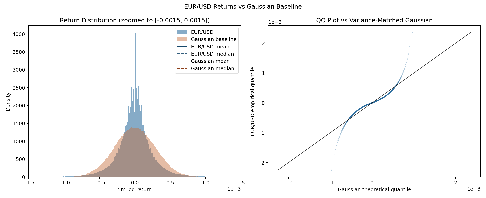
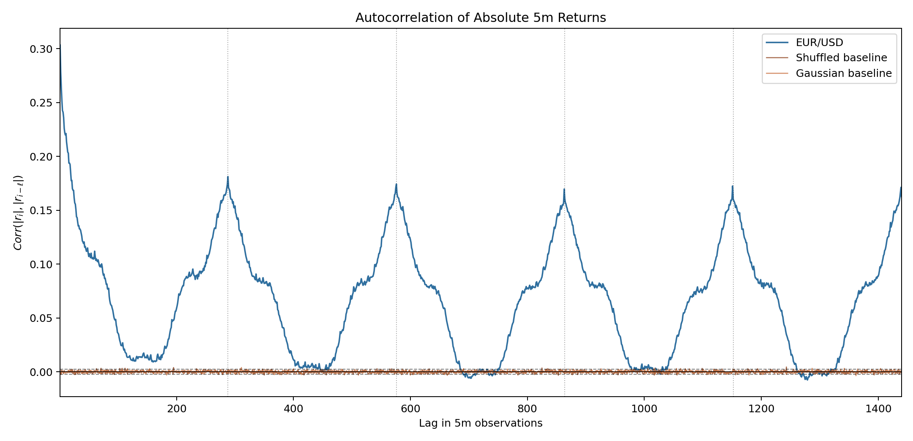
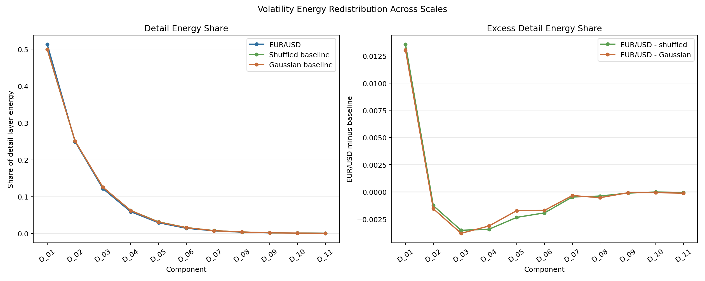
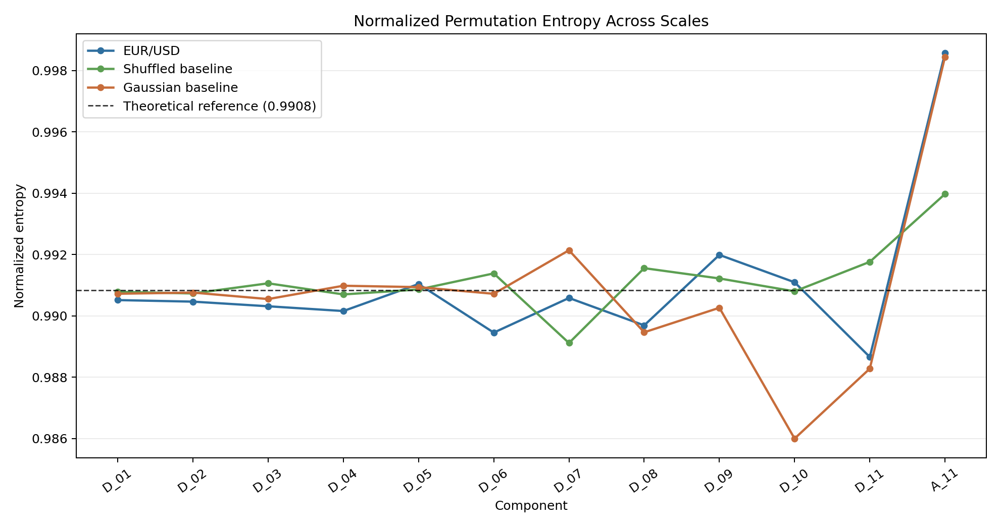

# Multi-Scale Volatility Structure in EUR/USD Returns

## 1. Motivation

This project explores the multi-scale structure of EUR/USD volatility using a minimalist dyadic decomposition framework applied to 5-minute log returns. The analysis compares real EUR/USD returns against two reference processes: a shuffled-return baseline, and a variance-matched Gaussian baseline.

The primary goal is to identify whether real FX volatility exhibits scale-dependent structure beyond heavy tails or independent noise alone. The current analysis intentionally focuses on global sample-level structure as a first-stage exploratory study prior to introducing time-local or event-based analysis.

## 2. Methodology

Exact implementation details and preprocessing caveats are found in `Documentation.md`.

### 2.1 Data and Preprocessing

The analysis uses [HistData EUR/USD 1-minute MetaTrader OHLC data](https://www.histdata.com/download-free-forex-historical-data/?/metatrader/1-minute-bar-quotes/EURUSD) for calendar years 2016 through 2025.

Log returns were computed as $r_j = \log(S_j) - \log(S_{j-1})$ where $S_j$ is the resampled 5m close.

Returns immediately following market closures,
holiday gaps, outages, or missing-candle jumps are removed, resulting in a cleaned 5-minute return series:

$$
R = \{r_1,\ldots,r_N\}, \text{ where } N = 735{,}706
$$

### 2.2 Dyadic Time Decomposition

Returns were decomposed using a recursive dyadic block-averaging procedure.

Define the following:

- Block size: $B_k = 2^k$
- Maximum layer: $K=11$
- Standardized return series: $R^{\ast}$, where $2^K$ divides the length of $R^{\ast}$

The return series is truncated from the end of the dataset to $N^{\ast} = 735{,}232$ which is divisible by $2^{11}=2048$. The standardized timestamp range is `2016-01-03 22:05 UTC` to `2025-12-30 06:25 UTC`.

The decomposition procedure is as follows.

Set $A_0=R^{\ast}$. Then for each layer $k=1,2,\ldots,K$

- Partition $A_0$ into non-overlapping blocks $b_1, \ldots, b_J$ each of size $B_k$
- Compute block mean $\mu_j^{(k)} = \frac{1}{B_k}\sum_{i \in b_j} A_{0,i}$ for each block
- Construct $A_k$ by repeating each block mean $B_k$ times, so $A_k$ has the same length as $A_0$
- Compute detail component $D_k = A_{k-1} - A_k$

The decomposition results are

- detail components $D_k$, representing fluctuations removed between adjacent scales
- approximation component $A_K$, representing the coarsest-scale structure

Approximate component horizons are indexed at the smaller time scale of each
detail-layer difference:

| Layer | Horizon | Layer | Horizon | Layer | Horizon |
| ----: | ------: | ----: | ------: | ----: | ------: |
|    D1 |      5m |    D5 |    1.3h |    D9 |   21.3h |
|    D2 |     10m |    D6 |    2.7h |   D10 |    1.8d |
|    D3 |     20m |    D7 |    5.3h |   D11 |    3.6d |
|    D4 |     40m |    D8 |   10.7h |   A11 |    7.1d |

The reconstructed series satisfies the additive identity:

$$
A_0 = A_K + \sum_{k=1}^{K} D_k
$$

up to machine precision (max error of `3.469446951953614e-18`)

Figure 1 illustrates the decomposition of EUR/USD returns.

### 2.3 Baseline Construction

Two baseline series of length $N^{\ast}$ were constructed for comparison.

- The shuffled baseline $R^{shuffle}$ was created by randomly permuting $R^{\ast}$.
- The Gaussian baseline $R^{BM}$ was generated using independent Gaussian samples $R_i^{BM} \sim \mathcal{N}(0,\sigma_R^2)$ where $\sigma_R^2 = \mathrm{Var}(R^{\ast})$

Together, these baselines isolate effects arising from:

- marginal distributional properties,
- heavy-tailed behavior,
- and genuine temporal organization.

The shuffled baseline is particularly useful as it preserves the empirical marginal distribution and heavy tails while destroying temporal ordering. Differences against this baseline isolate effects arising from temporal organization rather than distributional properties.

### 2.4 Diagnostics

Several diagnostics were computed across decomposition components and baselines, including

- Distribution: Histograms, QQ plots, and ECDFs.
- Volatility and Energy: RMS volatility and energy share for each decomposition component.
- Volatility Clustering: Autocorrelation of absolute returns and absolute decomposition components.
- Entropy: Normalized permutation entropy for each decomposition component.
- Cross-Scale Coupling: Pearson correlations between absolute decomposition components.

## 3. Baseline Diagnostics

### 3.1 Non-Gaussian Return Structure

EUR/USD returns exhibit strong deviations from Gaussian behavior.

Figure 2 compares the empirical return distribution against the variance-matched Gaussian baseline using a QQ plot and histogram. The empirical distribution shows both a sharper center and substantially heavier tails than the Gaussian baseline.

This behavior is consistent with well-known stylized facts of financial returns, including heavy tails and excess kurtosis.

### 3.2 Volatility Clustering

Although raw return autocorrelation is close to zero, absolute returns exhibit strong and persistent autocorrelation.

Figure 3 shows the autocorrelation of absolute returns for the empirical series and baselines. The empirical series displays slowly decaying correlation and periodic structure near daily horizons, while shuffled and Gaussian baselines have no meaningful correlation.

This behavior is consistent with volatility clustering and time-varying volatility regimes.

## 4. Multi-Scale Results

### 4.1 Volatility Energy Redistribution Across Scales

For each detail component $D_k$, detail energy share is defined as

$$
p_k^{detail}=\frac{E(D_k)}{\sum_{j=1}^{11}E(D_j)}, \text{ where } E(D_k)=\sum_i d_{k,i}^2
$$

Figure 4 shows detail energy share across scales together with excess energy relative to the shuffled and Gaussian baselines.

The empirical series exhibits excess finest-scale energy concentrated in the first decomposition layer, followed by a relative energy deficit at intermediate scales. Differences gradually decay toward zero at larger scales.

Relative to the shuffled baseline, the empirical process exhibits a redistribution of volatility energy toward the finest decomposition scales.

### 4.2 Cross-Scale Volatility Coupling

Figure 5 shows correlations between absolute decomposition components together with excess correlation relative to the shuffled baseline.

The empirical series exhibits broad positive cross-scale coupling across decomposition layers. In contrast, the Gaussian baseline is nearly decorrelated, while the shuffled baseline retains only fine-scale correlations.

This suggests that volatility activity is not isolated to individual scales; periods of elevated volatility tend to activate multiple temporal scales simultaneously.

### 4.3 Entropy Diagnostics

Permutation entropy was computed as an exploratory measure of ordinal complexity across decomposition layers.

Figure 6 shows permutation entropy across scales for the empirical series and baselines.

Across all scales, normalized permutation entropy remained close to the theoretical reference value of approximately $0.9908$ for both empirical and baseline series. Although deviations become visually larger at coarser scales, these layers contain fewer effective observations and higher estimator variance, making the apparent trend difficult to interpret robustly.

## 5. Discussion

The decomposition results suggest that EUR/USD volatility exhibits non-trivial organization across temporal scales.

The excess finest-scale energy observed in the empirical series indicates that volatility is more concentrated into localized short-horizon bursts than in either baseline. This may be due to market microstructure effects, fragmented order flow, or localized bursts of trading activity. The relative energy deficit at intermediate scales may reflect the presence of intraday short-horizon market structure.

At the same time, the broad positive cross-scale correlations suggest that volatility states are not isolated to specific decomposition layers, but instead shared across multiple scales simultaneously. The persistence of excess cross-scale correlation against the shuffled baseline suggests that this structure is not solely a consequence of the marginal return distribution, and may reflect broader volatility regimes spanning multiple horizons.

Several limitations remain.

Despite strong volatility decomposition effects, entropy differences remained comparatively weak under the current specification. While entropy remains as a potentially useful and interesting diagnostic statistic, current findings lack the robustness and significance to produce meaningful results.

The analysis uses only OHLC price data and does not incorporate volume, order flow, or options-implied information. The decomposition is global and static over the full sample period, preventing direct analysis of regime transitions or localized market events.

## 6. Next Steps

This current project is intended as a minimalist first-stage exploration of multi-scale volatility structure.

The next stage of the analysis will incorporate **time-local behavior** rather than global averages across the full sample. One direction is event-transition analysis, studying how decomposition structure evolves during transitions between low-volatility and high-volatility periods. Another direction is cross-scale volatility propagation, examining whether volatility activation appears simultaneously across scales or propagates hierarchically through time.
