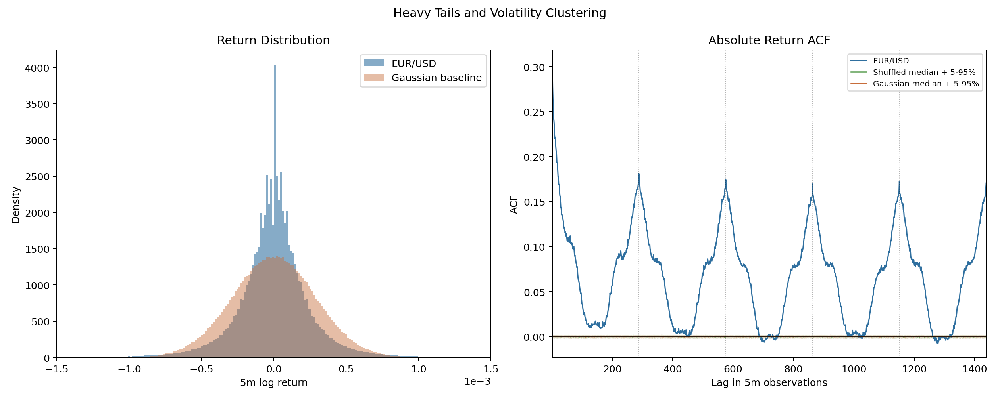
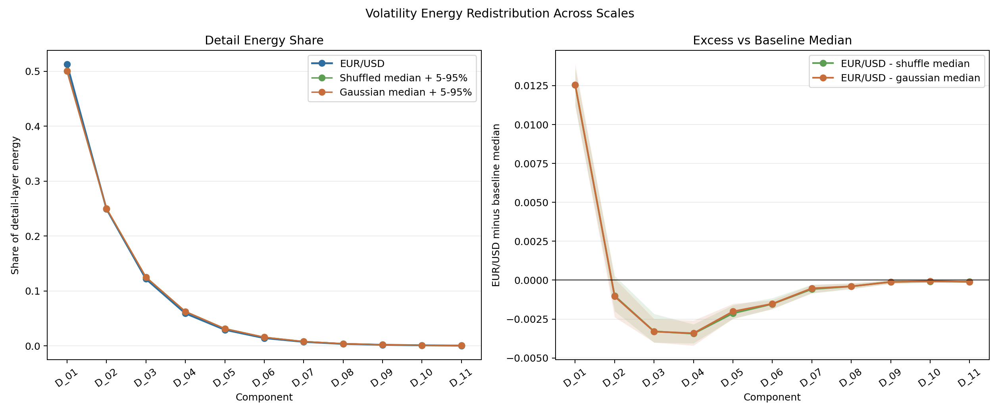
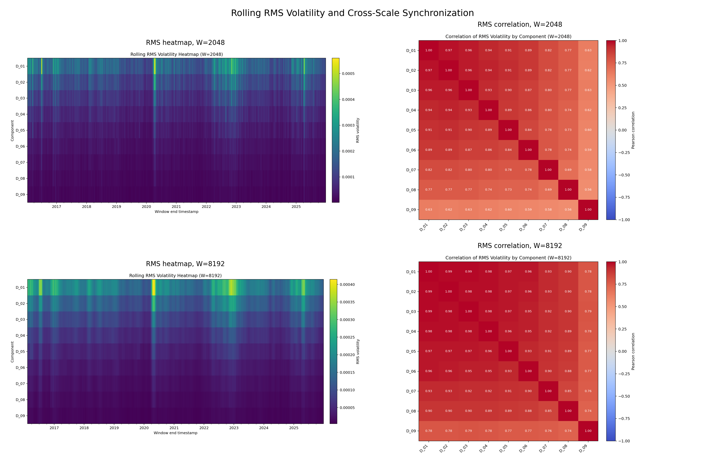
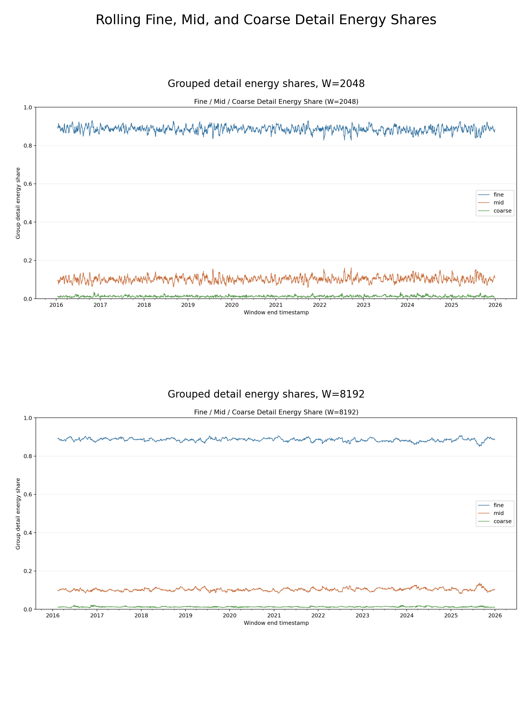
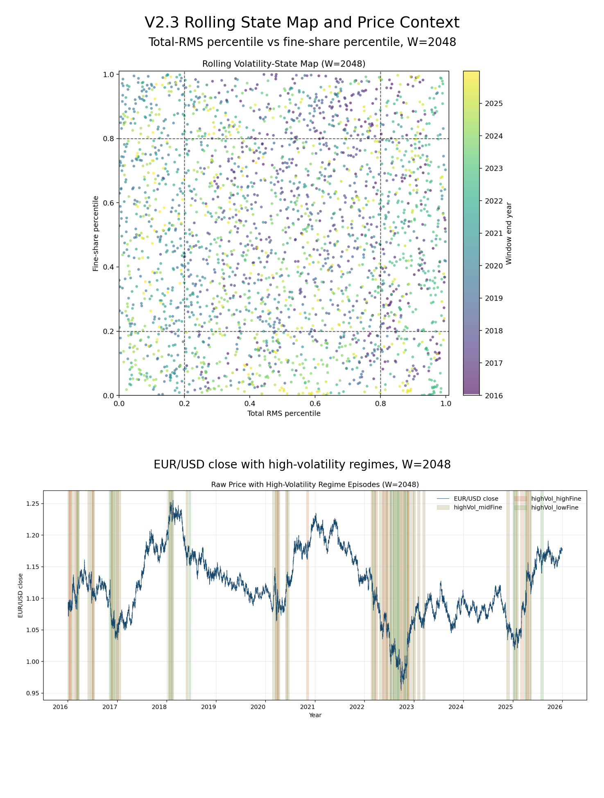

# Multi-Scale Volatility Structure in EUR/USD Returns: Global and Rolling Evidence

## 1. Motivation

This project studies empirical volatility structure in EUR/USD 5-minute returns using a dyadic multi-scale decomposition. The goal is to separate volatility level, scale allocation, and cross-scale dependence, and to compare these empirical features against Gaussian and shuffled-return baselines.

The motivating question is:

> How is empirical EUR/USD volatility structured across time and scale, and how does this structure differ from variance-matched Gaussian noise and shuffled heavy-tailed returns?

## 2. Methodology

The raw data consists of EUR/USD 1-minute bars from 2016-2025, resampled to 5-minute close prices. Returns are computed as:

$$
r_t = \log S_t - \log S_{t-1}.
$$

After cleaning weekend gaps and aligning the series for dyadic decomposition, the clean return series contains:

$$
N = 735{,}706
$$

observations. The truncated dyadic series contains:

$$
N^{\ast} = 735{,}232
$$

observations.

Let:

$$
A_0 = R^{\ast}
$$

denote the aligned return series. For scale $k$, define $A_k$ as the block-average approximation of $A_0$ at block size $2^k$, expanded back to the original observation grid. The detail component at scale $k$ is:

$$
D_k = A_{k-1} - A_k.
$$

Thus:

$$
A_0 = A_K + \sum_{k=1}^{K} D_k.
$$

Smaller $k$ corresponds to finer time-scale variation, while larger $k$ corresponds to coarser variation. The global full-sample decomposition uses $K=11$. The rolling-window analysis uses $K=9$, allowing both shorter and longer rolling windows to retain enough observations for stable component estimates.

Two baseline families are used. The Gaussian baseline samples iid returns from:

$$
\mathcal{N}(0,\hat{\sigma}^2),
$$

where $\hat{\sigma}^2$ is the empirical return variance. The shuffled baseline randomly permutes the empirical return series. The Gaussian baseline tests against variance-matched iid noise, while the shuffled baseline preserves the empirical marginal distribution, including heavy tails, but removes temporal ordering. For each baseline family, 100 simulations are generated, decomposed, and summarized using the pointwise median and 5-95% envelope.

For the rolling analysis, windows are defined by a fixed number of observations:

$$
W \in \{2048,8192\}, \qquad S=288,
$$

where $S$ is the rolling step size. $W=2048$ corresponds to roughly $7$ trading days, $W=8192$ corresponds to roughly $28$ trading days, and $S=288$ corresponds to one trading day of 5-minute observations. Each rolling window is labelled by its end timestamp.

For each window $q$, component RMS volatility is computed as:

$$
\sigma_{q,k}^{RMS,W}
=
\sqrt{\frac{1}{W}\sum_{t \in q} \left(D_{k,t}^{(q,W)}\right)^2}.
$$

Grouped detail energy shares are computed over three scale groups:

$$
\mathcal{G}_{fine}=\{D_1,D_2,D_3\},
\quad
\mathcal{G}_{mid}=\{D_4,D_5,D_6\},
\quad
\mathcal{G}_{coarse}=\{D_7,D_8,D_9\}.
$$

For group $g$, the grouped detail energy share is:

$$
p_{q,g}^{detail,W}
=
\frac{
\sum_{D_k\in \mathcal{G}_g} E(D_{q,k}^{(W)})
}{
\sum_{j=1}^{9} E(D_{q,j}^{(W)})
}.
$$

These rolling diagnostics allow volatility level and scale composition to be studied separately.

## 3. Global Multi-Scale Structure

### 3.1 Heavy tails and volatility clustering

The empirical return distribution is sharply peaked and heavy-tailed relative to a variance-matched Gaussian. This makes the Gaussian baseline useful but insufficient: deviations from Gaussian behavior may reflect marginal heavy tails rather than temporal volatility structure.

Absolute 5-minute returns show persistent autocorrelation, while Gaussian and shuffled baselines remain close to zero. Since the shuffled baseline preserves the empirical return distribution, the difference between empirical and shuffled autocorrelation indicates that return magnitudes are temporally organized, not merely heavy-tailed.

**Figure 1.** Empirical return distribution compared with a Gaussian baseline, plus autocorrelation of absolute 5-minute returns against Gaussian and shuffled baseline envelopes.

### 3.2 Global energy allocation differs from baselines

The full-sample decomposition shows that most detail energy lies in the finest components for both empirical and baseline series. However, empirical EUR/USD returns show a small but consistent redistribution of energy relative to the baselines: energy is higher at the finest scale and lower across several intermediate scales.

The largest positive deviation occurs at $D_1$, where the empirical detail energy share exceeds the shuffled median by $0.0126$ and the Gaussian median by $0.0126$. Intermediate components, especially $D_3$ through $D_6$, show negative deviations of approximately $-0.0034$ to $-0.0015$.

This suggests that the empirical series contains more fine-scale volatility concentration than would be expected from either iid Gaussian noise or a shuffled heavy-tailed series.

**Figure 2.** Detail energy share by scale, and empirical-minus-baseline median energy share differences with 5-95% baseline envelopes.

### 3.3 Cross-scale volatility coupling exceeds shuffled baselines

Cross-scale dependence provides stronger evidence of temporal volatility structure. Using absolute detail components, empirical EUR/USD shows positive dependence across many pairs of scales. Many of these empirical correlations lie outside the shuffled 5-95% envelope.

This result is important because the shuffled baseline preserves the empirical marginal return distribution. Therefore, excess cross-scale coupling cannot be explained by heavy tails alone. It reflects temporal dependence in volatility magnitudes: periods of elevated fine-scale activity tend to coincide with elevated activity at other scales.

The average empirical off-diagonal absolute-component correlation is $0.191$, compared with a shuffled median of $0.052$. The strongest excess occurs across adjacent middle/coarse pairs and cross-links into $D_5$ through $D_8$; examples include $D_7$-$D_8$ at $+0.236$, $D_8$-$D_9$ at $+0.227$, and $D_5$-$D_6$ at $+0.220$ relative to the shuffled median.

**Figure 3.** Empirical absolute-component cross-scale correlation and excess relative to the shuffled baseline median.

## 4. Rolling Multi-Scale Volatility

### 4.1 Rolling RMS volatility shows a common cross-scale volatility state

Rolling RMS volatility reveals a strong common volatility state across scales. High-volatility periods raise RMS volatility across nearly all detail components rather than remaining isolated to a single horizon. This pattern appears for both $W=2048$ and $W=8192$.

The average off-diagonal RMS correlation is $0.792$ for $W=2048$ and $0.900$ for $W=8192$. Correlations are slightly higher for the longer window, likely because short-term local discrepancies are averaged out and broader volatility regimes become more visible.

Compared with Gaussian and shuffled baselines, empirical RMS correlations are substantially stronger. The empirical average RMS correlation exceeds the shuffled median by $0.443$ for $W=2048$ and $0.537$ for $W=8192$. This indicates that cross-scale RMS synchronization is not simply an artifact of the decomposition procedure or the marginal return distribution.

**Figure 4.** Rolling RMS volatility heatmaps and RMS component correlation matrices for $W=2048$ and $W=8192$.

### 4.2 Scale composition is stable over time

The rolling RMS result contrasts with the grouped energy-share result. While volatility level changes substantially over time, the relative allocation of detail energy across fine, mid, and coarse groups is much more stable.

Across both rolling window lengths, the fine group consistently dominates total detail energy. For $W=2048$, the mean fine, mid, and coarse shares are $0.885$, $0.102$, and $0.012$. For $W=8192$, the corresponding shares are $0.885$, $0.103$, and $0.012$.

This suggests that major volatility regimes are primarily changes in volatility level rather than large reallocations of relative energy across scales. In other words, EUR/USD volatility rises and falls strongly, but the decomposition remains consistently fine-dominated.

**Figure 5.** Rolling fine, mid, and coarse detail energy shares for $W=2048$ and $W=8192$.

### 4.3 Volatility level and scale composition are distinct diagnostics

The near-zero correlations between total RMS volatility and grouped energy shares show that volatility level and scale composition are distinct diagnostics. A high-volatility window is not mechanically more fine-concentrated or more coarse-concentrated.

| Window length | Corr(total RMS, fine share) | Corr(total RMS, mid share) | Corr(total RMS, coarse share) |
| ------------: | --------------------------: | -------------------------: | ----------------------------: |
|      $W=2048$ |                      -0.025 |                      0.020 |                         0.026 |
|      $W=8192$ |                       0.003 |                     -0.005 |                         0.005 |

This distinction is useful. Rolling RMS captures the intensity of volatility, while grouped energy shares capture the relative scale composition of that volatility. The main empirical finding is that volatility intensity varies strongly and synchronously across scales, while relative scale composition remains much more stable.

## 5. Discussion

The global and rolling analyses point to the same conclusion from different angles. The global decomposition shows that empirical EUR/USD volatility has structure beyond iid Gaussian noise and beyond shuffled heavy-tailed returns. The rolling decomposition shows that this structure is dominated by a common volatility state: when volatility rises, it tends to rise across many scales simultaneously.

The strongest V2 result is the cross-scale synchronization of RMS volatility. High-volatility periods are not isolated to a single component; they appear as broad increases in RMS across the decomposition. This is especially important because the effect remains strong relative to shuffled baselines, indicating that temporal ordering matters.

At the same time, energy-share composition is comparatively stable. Most detail energy remains concentrated in fine scales, and the fine/mid/coarse allocation changes much less than RMS volatility level. This means that volatility regimes are primarily level regimes rather than large-scale composition regimes.

The near-zero relationship between total RMS and grouped energy shares adds another layer to this interpretation. Volatility level and scale composition are not the same object. A window can have high volatility without having an unusually high or low fine-scale share. This motivates treating total RMS and energy-share composition as separate descriptive dimensions.

Permutation entropy was also evaluated as an information-theoretic diagnostic. However, normalized entropy remained close to baseline across most scales and was less informative than the volatility and energy-based measures. For this reason, the current interpretation focuses on volatility structure rather than entropy as a standalone uncertainty measure.

## 6. Next Steps: Event-Aligned Transition Analysis

The rolling results motivate a more focused study of high-volatility transitions. V2 shows that volatility levels co-move strongly across scales, but it does not determine whether shocks begin in fine scales and then propagate to broader scales, or whether many scales activate simultaneously.

As an exploratory extension, rolling windows were also mapped by total-RMS percentile and fine-share percentile. This state map did not reveal a strong dependence between volatility level and fine-scale concentration, but it provided a useful way to classify high-volatility windows by scale composition. High-volatility lowFine windows showed relatively more mid-scale activation, while high-volatility highFine windows appeared more fine-concentrated and somewhat more burst-like. These differences are modest and should be interpreted as composition tilts rather than distinct market regimes.

**Figure 6.** V2.3 regime-state map for $W=2048$ and raw EUR/USD close with high-volatility regime shading.

The natural next step is event-aligned transition analysis. High-volatility episodes can be defined from rolling total RMS, then aligned around episode starts, peaks, and decays. The key question is whether fine-scale bursts transition into broader mid-scale volatility states, or whether high-volatility episodes are better described as simultaneous cross-scale activation.

Possible V3 diagnostics include aligned RMS trajectories for fine, mid, and coarse groups; transition patterns between fine-share states; and directional movement measures such as trend ratio. In this sense, V2 provides the state-space map, while V3 studies transitions through that state space.
