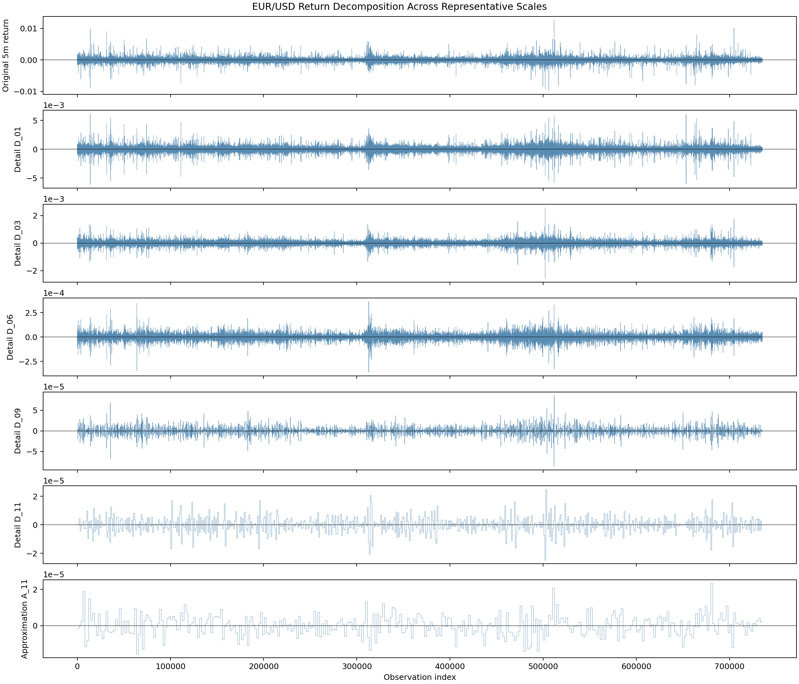
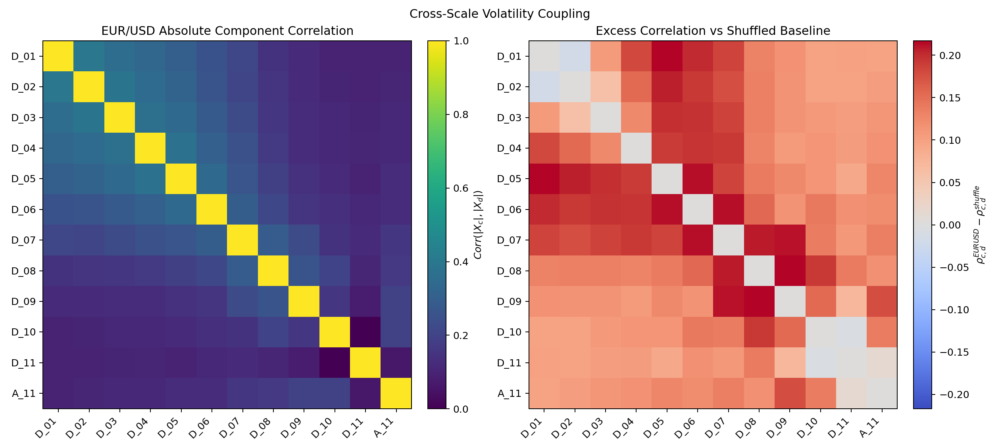

# Multi-Scale Volatility Structure in EUR/USD Returns

Baseline version complete; extensions and optimizations ongoing.

- `Memo.md` - concise research summary and findings
- `Documentation.md` - exact preprocessing, decomposition, and metric definitions
- `README.md` - project overview and reproduction guide
- `plots/` and `results/` - generated figures, metric tables, and findings

## Objective

This project explores the **multi-scale** structure of **EUR/USD volatility** using a minimalist dyadic decomposition framework applied to 5-minute log returns. The analysis compares real EUR/USD returns against two reference processes: a shuffled-return baseline, and a variance-matched Gaussian baseline.

The primary goal is to identify whether real FX volatility exhibits scale-dependent structure beyond heavy tails or independent noise alone.

This current project is intended as a **minimalist first-stage exploration** of multi-scale volatility structure. The design intentionally has

- No forecasting
- No rolling windows
- No regime classification
- No event studies
- No optimization-heavy methods

## Key Findings

- EUR/USD volatility exhibits excess finest-scale energy relative to shuffled and Gaussian baselines.
- Intermediate decomposition scales show relative energy deficits.
- Volatility states exhibit persistent cross-scale coupling beyond what is explained by heavy tails alone.
- Absolute-return autocorrelation confirms strong volatility clustering.
- Permutation entropy differences were comparatively weak under the current specification.

### Example Decomposition



### Cross-Scale Volatility Coupling



## Reproduce the Pipeline

Ensure that Python 3.13 is installed

Install dependencies:

```powershell
pip install -e .
```

Run the full pipeline:

```powershell
ve run-all
```

Or run each step explicitly:

```powershell
ve preprocess
ve standardize
ve baselines
ve decompose
ve volatility
ve entropy
ve plot eda
ve plot decomposition
ve plot volatility
ve plot entropy
ve plot memo
```

## Repository Structure

```text
src/
  multi_scale_volatility/
    config/
    plotting/
    preprocessing/
    stats/
    utils/

data/
  raw/
  intermediate/
  final/
  baselines/
  decomposition/

results/
  volatility/
  entropy/

plots/
  eda/
  results/
  memo/

Documentation.md
Memo.md
README.md
```

## Current Status

V1 complete:

- preprocessing pipeline,
- dyadic decomposition,
- baseline construction,
- volatility diagnostics,
- entropy diagnostics,
- cross-scale correlation analysis.

Currently exploring:

- time-local volatility propagation,
- event-transition analysis,
- robustness check on more baselines.
