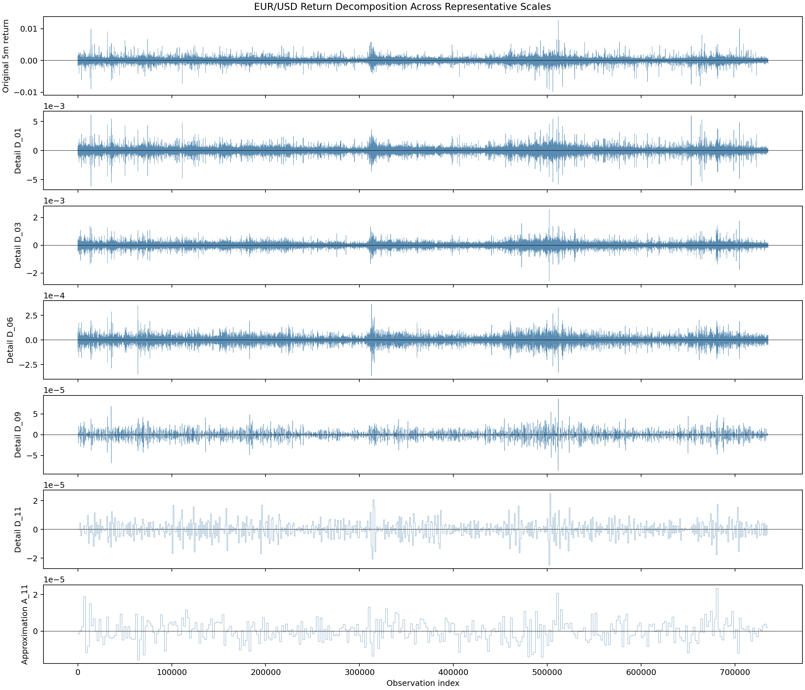
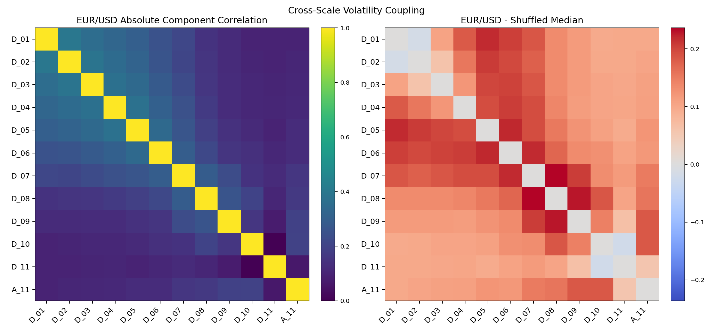

# Multi-Scale Volatility Structure in EUR/USD Returns

Current version: **V1.1**. Extensions and optimizations ongoing.

V1.1 keeps the original pipeline and replaces the old single-draw baselines with Monte Carlo baseline envelopes.

- `Memo.md` - concise research summary and findings
- `Documentation.md` - exact preprocessing, decomposition, metric, and baseline-envelope definitions
- `README.md` - project overview and reproduction guide
- `plots/` and `results/` - generated figures, metric tables, and comparisons

## Objective

This project explores the **multi-scale** structure of **EUR/USD volatility** using a minimalist dyadic decomposition framework applied to 5-minute log returns.

The analysis compares real EUR/USD returns against two reference processes:

- shuffled-return baselines, which preserve the empirical return distribution
  while destroying temporal order
- variance-matched Gaussian baselines, which represent independent Gaussian
  increments with the empirical population variance

The primary goal is to identify whether real FX volatility exhibits
scale-dependent structure beyond heavy tails or independent noise alone.

This project is intentionally a minimalist first-stage exploration. It does not
include forecasting, rolling windows, regime classification, event studies, or
optimization-heavy methods.

## Key Findings

- EUR/USD volatility exhibits excess finest-scale energy relative to the median
  shuffled and Gaussian baseline profiles.
- Intermediate decomposition scales show relative energy deficits.
- Volatility states exhibit persistent cross-scale coupling beyond what is
  explained by the shuffled baseline envelope.
- Absolute-return autocorrelation confirms strong volatility clustering.
- Permutation entropy differences remain comparatively weak under the current
  specification.

### Example Decomposition



### Cross-Scale Volatility Coupling



## Reproduce the V1.1 Pipeline

Ensure that Python 3.13 is installed.

Install dependencies:

```powershell
pip install -e .
```

Run the full V1.1 pipeline:

```powershell
ve run-all
```

This runs preprocessing, length standardization, empirical decomposition,
empirical metrics, Monte Carlo baseline generation, Monte Carlo baseline metrics
and comparisons, and V1.1 plot generation.

Or run each V1.1 step explicitly:

```powershell
ve preprocess
ve standardize
ve decompose
ve volatility
ve entropy
ve baselines
ve monte-carlo-metrics
ve monte-carlo-comparisons
ve plot memo
```

## Repository Structure

```text
src/
  multi_scale_volatility/
    config/
    plotting/
    preprocessing/
    stats/
    utils/

data/
  raw/
  intermediate/
  final/
  decomposition/
  monte_carlo_baselines/
    returns/
    decomposition/

results/
  volatility/
  entropy/
  monte_carlo_baselines/

plots/
  eda/
  results/
  memo/

Documentation.md
Memo.md
README.md
```

## Current Status

V1.1 complete:

- preprocessing pipeline,
- dyadic decomposition,
- Monte Carlo baseline construction,
- volatility diagnostics,
- entropy diagnostics,
- cross-scale correlation analysis.

Currently exploring:

- time-local volatility propagation,
- event-transition analysis,

Known runtime note: entropy is the slowest Monte Carlo metric stage.
